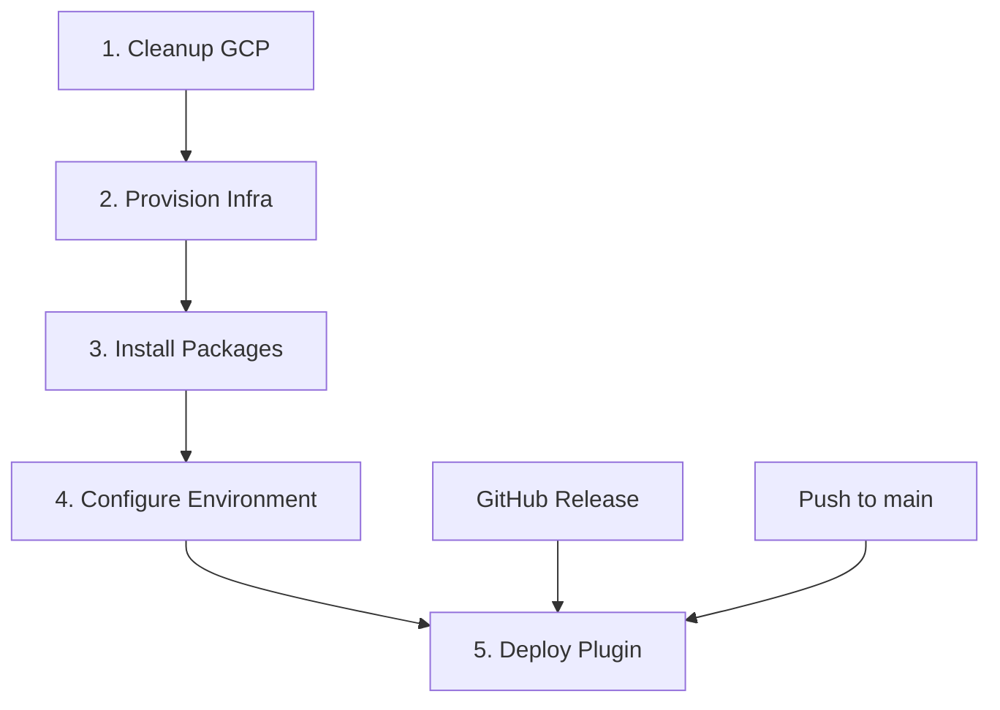

# Smart Gallery - Modular Deployment Architecture

## 🏗️ **Terraform + GitHub Actions Modular Deployment**

Esta arquitetura implementa um sistema completo de deployment modular para o plugin Smart Gallery, usando Terraform para infraestrutura e GitHub Actions para automação.

## 📋 **Arquitetura dos Workflows**

### 1️⃣ **Cleanup GCP** (`1-cleanup-gcp.yml`)
- 🧹 Limpa recursos GCP existentes usando o script otimizado
- 🔒 Suporte a dry-run para segurança
- ⚡ Execução manual com confirmações

### 2️⃣ **Provision Infrastructure** (`2-provision-infra.yml`) 
- 🏗️ Terraform provisiona VM + Rede + Firewall + DNS
- 🆓 Otimizado para free tier GCP (e2-micro)
- 🔑 Geração automática de chaves SSH
- 📊 Outputs estruturados para próximos workflows

### 3️⃣ **Install Packages** (`3-install-packages.yml`)
- 📦 Instala Nginx + PHP + MariaDB + WP-CLI
- 🐘 Baseado no ambiente DDEV (PHP 8.3 + extensões)
- 🗄️ Configuração segura do banco de dados
- 🛠️ Ferramentas essenciais (Composer, Certbot, etc.)

### 4️⃣ **Configure Environment** (`4-configure-env.yml`)
- ⚙️ Instala e configura WordPress
- 🔒 SSL automático com Let's Encrypt
- 🔌 Instala plugins essenciais (Elementor, Pods, SEO, Segurança)
- 🌐 Configuração otimizada do Nginx

### 5️⃣ **Deploy Plugin** (`5-deploy-plugin.yml`)
- 🚀 Deploy do Smart Gallery da versão mais recente
- 📦 Suporte a versões específicas ou latest
- ✅ Ativação automática do plugin
- 🔄 Trigger automático em releases e pushes

## 🎯 **Fluxo de Execução**



## 🔧 **Configuração Inicial**

### **GitHub Secrets Necessários:**
```bash
GCP_SA_KEY          # Service Account JSON completo
GCP_PROJECT_ID      # ID do projeto GCP (opcional, pode ser input)
```

### **GitHub Variables (Opcionais):**
```bash
GCP_VM_INSTANCE     # Nome padrão da VM
GCP_VM_ZONE         # Zona padrão da VM
```

### **Terraform Setup:**
```bash
# 1. Copiar arquivo de variáveis
cp terraform/terraform.tfvars.example terraform/terraform.tfvars

# 2. Editar com seus valores
vim terraform/terraform.tfvars

# 3. Executar via GitHub Actions ou localmente:
cd terraform
terraform init
terraform plan
terraform apply
```

## 🚀 **Como Usar**

### **Deploy Completo (Primeira vez):**
1. Execute **Cleanup GCP** (dry-run primeiro)
2. Execute **Provision Infrastructure** 
3. Execute **Install Packages**
4. Execute **Configure Environment**
5. Execute **Deploy Plugin**

### **Deploy Apenas do Plugin (atualizações):**
- Execute apenas **Deploy Plugin**
- Ou faça push/release que triggera automaticamente

### **Inputs Necessários por Workflow:**

#### **1. Cleanup GCP:**
- `project_id`: ID do projeto GCP
- `dry_run`: true/false (recomendado: true primeiro)
- `force_cleanup`: true/false (necessário para execução real)

#### **2. Provision Infrastructure:**
- `project_id`: ID do projeto GCP
- `domain_name`: Domínio completo (ex: smartgallery.exemplo.com)
- `environment`: staging/production
- `region`: us-central1 (recomendado para free tier)
- `machine_type`: e2-micro (free tier)

#### **3. Install Packages:**
- `project_id`: ID do projeto GCP
- `vm_instance`: Nome da VM (do step anterior)
- `vm_zone`: Zona da VM (do step anterior)
- `php_version`: 8.1/8.2/8.3 (padrão: 8.3)

#### **4. Configure Environment:**
- `project_id`: ID do projeto GCP
- `vm_instance`: Nome da VM
- `vm_zone`: Zona da VM
- `domain_name`: Domínio do site
- `site_title`: Título do WordPress
- `admin_user`: Usuário admin (padrão: admin)
- `admin_email`: Email do admin
- `letsencrypt_email`: Email para certificado SSL

#### **5. Deploy Plugin:**
- `project_id`: ID do projeto GCP
- `vm_instance`: Nome da VM
- `vm_zone`: Zona da VM
- `plugin_version`: latest/específica (padrão: latest)
- `activate_plugin`: true/false (padrão: true)

## 💰 **Custos (Free Tier)**

- **VM e2-micro**: ✅ Grátis (744h/mês)
- **Disco 20GB**: ✅ Grátis (30GB inclusos)
- **Rede**: ✅ Grátis (1GB egress/mês)
- **IP Estático**: ✅ Grátis (1 IP incluso)

## 🔒 **Segurança**

- ✅ Firewall configurado (apenas SSH, HTTP, HTTPS)
- ✅ SSL obrigatório com Let's Encrypt
- ✅ Fail2ban instalado
- ✅ Headers de segurança configurados
- ✅ Plugin Wordfence instalado
- ✅ Service Account com permissões mínimas

## 🎉 **Resultado Final**

Após execução completa:
- ✅ VM GCP provisionada e configurada
- ✅ WordPress instalado com SSL
- ✅ Smart Gallery plugin ativo
- ✅ Elementor + Pods configurados
- ✅ Site acessível via HTTPS
- ✅ Admin WordPress funcional

## 🔄 **Manutenção**

- **Atualizações do Plugin**: Execute workflow 5 ou faça release/push
- **Backup**: Use script de backup incluído
- **Monitoramento**: Logs em `/var/log/smart-gallery/`
- **SSL Renewal**: Automático via crontab
- **Cleanup**: Execute workflow 1 quando necessário